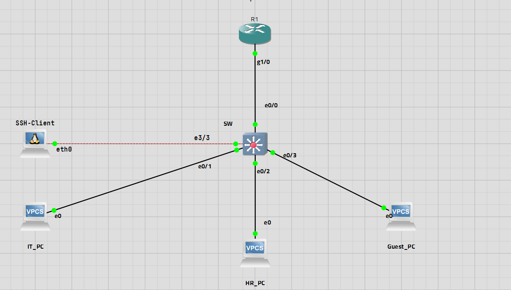

# 🧠 Small Office Network 

## 🎯 Objective

Design and implement a small office network using Cisco devices in GNS3. Demonstrates VLAN segmentation, inter-VLAN routing, DHCP, trunk configuration, basic Layer 2 security, and SSH management.

---

## 🧩 Network Overview

- VLAN 10 – IT (`192.168.10.0/24`)
- VLAN 20 – HR (`192.168.20.0/24`)
- VLAN 30 – Guests (`192.168.30.0/24`)
- VLAN 99 – Management (`192.168.100.0/24`)
- Inter-VLAN routing using Router-on-a-Stick
- DHCP provided by the Router
- Port Security
- PortFast and BPDU Guard
- SSH management

---

## 🖥️ Tools

- GNS3
- Cisco C7200
- Cisco IOS L2 Switch
- VPCS
- ssh-client (ubuntu 20.04.2 LTS (Focal Fossa)")

---

## 📊 Topology



---

## ⚙️ Configuration Summary

### Router 
```text
- Router-on-a-Stick
- VLAN 10 Gateway: 192.168.10.1
- VLAN 20 Gateway: 192.168.20.1
- VLAN 30 Gateway: 192.168.30.1
- VLAN 99 Gateway: 192.168.100.120
- DHCP Server
- SSH Management

```
### Switch
``` 
- VLAN 10 – IT
- VLAN 20 – HR
- VLAN 30 – Guests
- VLAN 99 – Management
- 802.1Q Trunk
- Access Ports
- Port Security
- PortFast
- BPDU Guard
- Unused Port Shutdown
- SSH Management
```
## 🧪 Verification

| Test | Screenshot |
|------|------------|
| VLAN | [View](screenshots/Vlans.png) |
| Trunk | [View](screenshots/Trunk.png) |
| Routing | [View](screenshots/Routing.png) |
| DHCP | [View](screenshots/dhcp.png) |
| Security | [View](screenshots/PortSecurity.png) |
| SW-SSH | [View](screenshots/sshToSw.png) |
| R-SSH | [View](screenshots/sshToRouter.png) |
