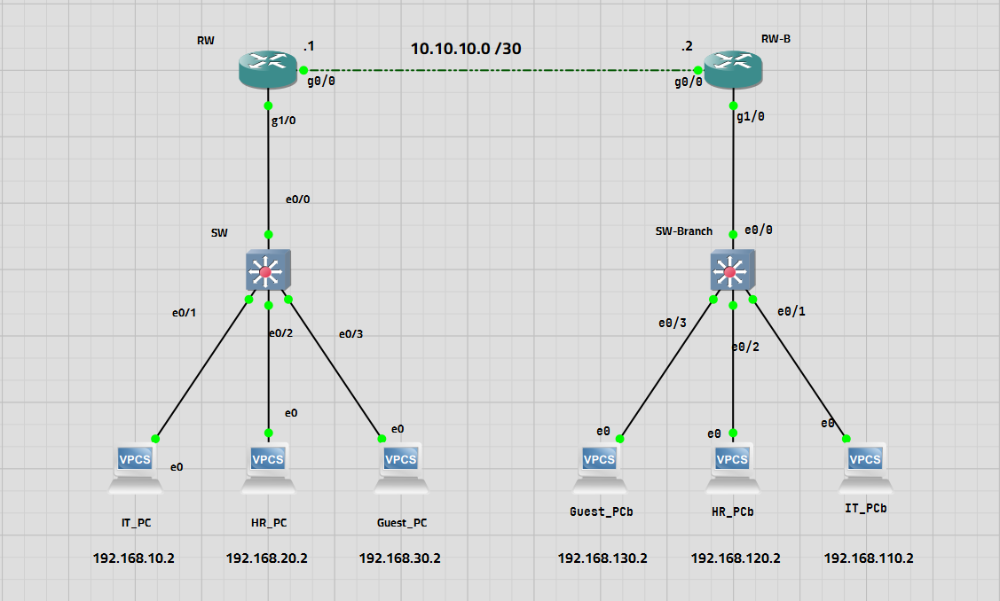
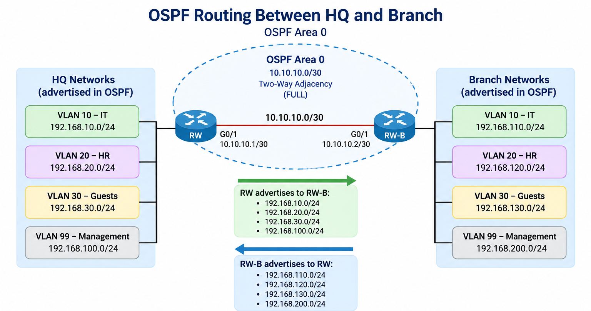
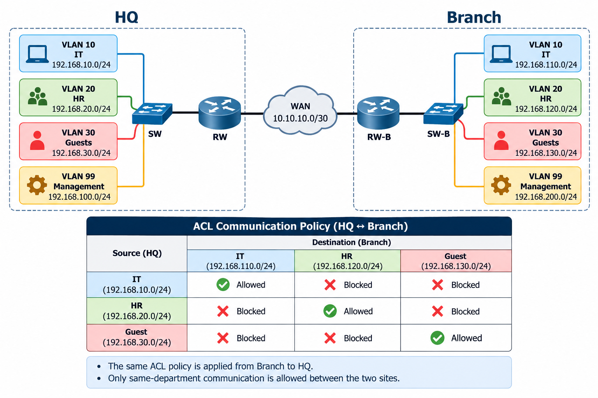

# 🌐 Two-Site Enterprise Network

## 🎯 Objective

Design and implement a two-site enterprise network using Cisco devices in GNS3.

This project demonstrates VLAN segmentation, inter-VLAN routing, DHCP, WAN connectivity, OSPF dynamic routing, and extended ACLs for traffic control between departments.

---

## 🧩 Network Overview

### 🏢 HQ

- VLAN 10 – IT (`192.168.10.0/24`)
- VLAN 20 – HR (`192.168.20.0/24`)
- VLAN 30 – Guests (`192.168.30.0/24`)
- VLAN 99 – Management (`192.168.100.0/24`)

### 🏢 Branch

- VLAN 10 – IT (`192.168.110.0/24`)
- VLAN 20 – HR (`192.168.120.0/24`)
- VLAN 30 – Guests (`192.168.130.0/24`)
- VLAN 99 – Management (`192.168.200.0/24`)

### 🌐 WAN

- `RW` → `10.10.10.1/30`
- `RW-B` → `10.10.10.2/30`
- Network → `10.10.10.0/30`

### Routing

- Router-on-a-Stick
- Inter-VLAN routing
- OSPF Area 0
- Dynamic routing between HQ and Branch

---

## 🖥️ Tools

- GNS3
- 2 Cisco C7200
- 2 Cisco IOS L2 Switches
- 6 VPCS

---

## 📊 Topology

---

## ⚙️ Configuration Summary

### Routers

- VLAN subinterfaces
- Inter-VLAN routing
- DHCP
- WAN connectivity
- OSPF
- Extended ACLs

### Switches

- VLAN 10 – IT
- VLAN 20 – HR
- VLAN 30 – Guests
- VLAN 99 – Management
- 802.1Q trunking
- Access ports

---

## 🔄 OSPF

OSPF is used to exchange routing information between the HQ and Branch routers.

## 🔐 ACL Security

Extended ACLs are used to control communication between departments across the HQ and Branch sites.

### Communication Policy

- HQ → Branch
- Branch → HQ

This allows each department to communicate with the corresponding department at the other site while preventing communication between different departments.

---

## 🔒 Layer 2 Security

Access ports are protected using:

- Port Security
- Sticky MAC addresses
- PortFast
- BPDU Guard
- Unused ports shutdown

---
## 🔍 Project Verification

| Test                  | Screenshot                                      |
| --------------------- | ----------------------------------------------- |
| VLAN Configuration    | [View](screenshots/vlans.png)                   |
| Trunk Configuration   | [View](screenshots/int-trunk.png)               |
| Interface Status      | [View](screenshots/int-brief.png)               |
| OSPF Neighbor         | [View](screenshots/ospf-neighbor.png)           |
| OSPF Routes           | [View](screenshots/ospf-route.png)              |
| ACL Configuration     | [View](screenshots/ACLs.png)                    |
| ACL Connectivity      | [View](screenshots/ping_connectivity.png)       |
| Port Security         | [View](screenshots/port-sec.png)                |
